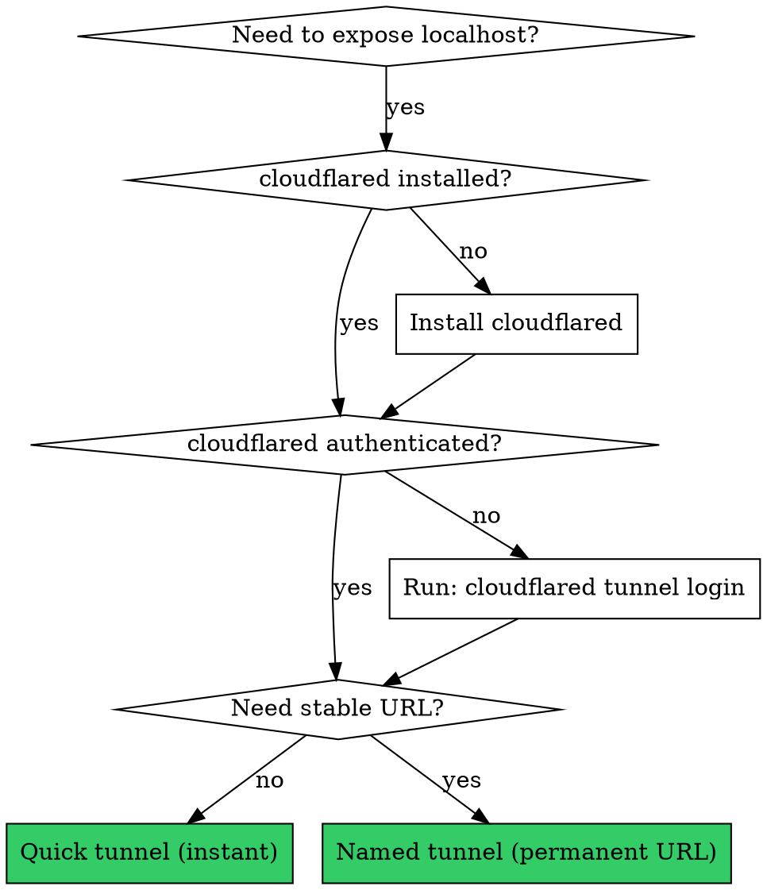

# Cloudflare Tunnel Setup

Expose local dev servers via Cloudflare Tunnel with zero port forwarding, zero firewall config.

## Quick Start Decision



## Step 1: Prerequisites

```bash
# Check if installed
cloudflared --version

# Install if missing (Windows)
winget install cloudflare.cloudflared

# Authenticate (opens browser — user must click to authorize)
cloudflared tunnel login
# Verify: ~/.cloudflared/cert.pem exists after auth
```

## Step 2: Fix Vite allowedHosts FIRST

**CRITICAL: Do this BEFORE starting any tunnel.** Vite blocks unknown hostnames by default.

```typescript
// vite.config.ts — add allowedHosts: true to server block
server: {
  port: 5176,
  allowedHosts: true,  // <-- allows Cloudflare tunnel hostnames
}
```

**Then restart the dev server.** The allowedHosts change requires a restart.

## Step 3a: Quick Tunnel (instant, random URL)

```bash
cloudflared tunnel --url http://localhost:PORT
```

- Works immediately, no DNS needed
- URL is random (e.g., `abc-def-ghi.trycloudflare.com`)
- Stops when you kill the process
- No account needed

## Step 3b: Named Tunnel (stable subdomain)

**Requires:** Cloudflare account + domain with Cloudflare nameservers

```bash
# Create tunnel
cloudflared tunnel create TUNNEL_NAME

# Route to subdomain (adds CNAME automatically)
cloudflared tunnel route dns TUNNEL_NAME subdomain.yourdomain.com

# Run tunnel
cloudflared tunnel --url http://localhost:PORT run TUNNEL_NAME
```

**Named tunnels require your domain's nameservers to point to Cloudflare.** If nameservers are elsewhere (e.g., dotster, GoDaddy), the subdomain won't resolve. Use quick tunnel as fallback.

## Changing Nameservers (the hard part)

Cloudflare tells you which nameservers to set. The registrar UI is often buried.

| Registrar | Path to Nameservers |
|-----------|-------------------|
| Network Solutions | Advanced View → check domain → Actions dropdown → or `networksolutions.com/manage-it/edit-nameservers.jsp` (old UI, must select domain first) |
| GoDaddy | My Products → DNS → Nameservers → Change |
| Namecheap | Domain List → Manage → Nameservers → Custom DNS |
| Google Domains | DNS → Custom name servers |

**If the registrar UI is painful:** Use their live chat support and ask them to change nameservers. They can do it instantly.

**Propagation:** 5 min to 48 hours. Check with `nslookup yourdomain.com 1.1.1.1`

## Troubleshooting

| Symptom | Fix |
|---------|-----|
| `Blocked request. This host is not allowed` | Add `allowedHosts: true` to vite.config.ts server block, restart dev server |
| `ERR_CONNECTION_RESET` on named tunnel URL | DNS hasn't propagated — nameservers still pointing to old registrar. Use quick tunnel. |
| `You are modifying DNS for these domains:` (empty) | Network Solutions bug — domain not selected. Use Advanced View, check domain, then Actions. |
| `cert.pem not found` | Run `cloudflared tunnel login` and complete browser auth |
| Tunnel running but page blank | Dev server not running on the specified port. Check `curl localhost:PORT` |

## Running as Background Service (Windows)

```bash
# Install as Windows service (persistent across reboots)
cloudflared service install
# Configure in: C:\Users\USERNAME\.cloudflared\config.yml
```

```yaml
# config.yml
tunnel: TUNNEL_ID
credentials-file: C:\Users\USERNAME\.cloudflared\TUNNEL_ID.json
ingress:
  - hostname: demos.yourdomain.com
    service: http://localhost:5176
  - hostname: api.yourdomain.com
    service: http://localhost:3000
  - service: http_status:404
```

## Multiple Services on One Tunnel

```yaml
# config.yml — route multiple subdomains through one tunnel
ingress:
  - hostname: demos.guitaralchemist.com
    service: http://localhost:5176
  - hostname: api.guitaralchemist.com
    service: http://localhost:3000
  - hostname: dashboard.guitaralchemist.com
    service: http://localhost:8080
  - service: http_status:404  # catch-all required
```
