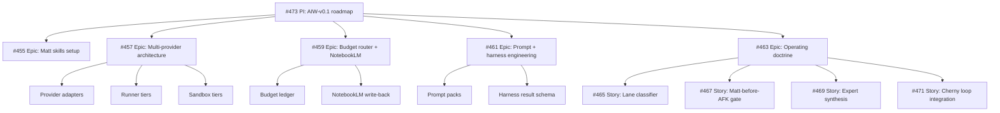

# AIW-v0.1 Roadmap

## Purpose

This is the navigational parent for the AIW-v0.1 workstream.

It organizes the current GitHub issues into a simple hierarchy:

```text
PI / Program Increment
  -> Epic
     -> Story
        -> Task
```

GitHub does not enforce hierarchy natively, so this issue acts as the roadmap and table of contents. Individual issues should link back here and to their immediate parent.

## PI Goal

Build a budget-aware, GitHub-centered AI workforce system for Demerzel that can coordinate multiple AI providers and local/cloud runners while preserving governance, auditability, cost control, and human review.

## Level definitions

### PI

A time-bounded or theme-bounded program of work that spans several epics.

For AIW-v0.1, the PI is this issue.

### Epic

A major capability area that can contain several stories.

Epics should usually produce architecture docs, schemas, examples, or end-to-end workflow design.

### Story

A user-visible or operator-visible workflow improvement.

Stories should be independently implementable and testable.

### Task

A concrete implementation step: create a doc, schema, prompt template, script, example artifact, label set, or test.

Tasks can be split from stories as implementation begins.

## Hierarchy

### PI: AI Workforce v0.1

- #473 — `[PI][AIW-v0.1] AI Workforce roadmap and issue hierarchy`

### Epic 1 — Workflow foundations and skill setup

- #455 — Capture Matt Pocock skills configuration for Demerzel workflows

Stories / tasks under this epic:

- document installed skills and setup choices;
- map Matt skills to Demerzel workflows;
- define issue shape produced by `/triage`, `/to-issues`, `/to-prd`, `/grill-with-docs`, `/tdd`, and `/diagnosing-bugs`;
- define Artifact/GitHub surface map from the #455 comment.

### Epic 2 — Multi-provider AI workforce architecture

- #457 — Multi-provider AI workforce orchestration via GitHub runners

Stories / tasks under this epic:

- define provider adapter contract;
- model Claude Code, Codex, Jules, Gemini, Ollama, Augment/Antigravity;
- define Windows/WSL self-hosted runner use;
- define GitHub-hosted fallback;
- define Podman/worktree/VM/cloud sandbox tiers;
- define provider/runner/sandbox routing rules.

### Epic 3 — Budget-aware delegation and NotebookLM

- #459 — Budget-aware delegation router and NotebookLM adapter

Stories / tasks under this epic:

- add budget fields to AIW job spec;
- define provider delegation matrix;
- define stop/approval thresholds;
- create budget ledger artifact;
- define NotebookLM manual-assisted MVP;
- define Drive-mediated NotebookLM workflow;
- define write-back rules to GitHub/Drive/repo docs.

### Epic 4 — Prompt and harness engineering

- #461 — Prompt and harness engineering discipline for AFK agents

Stories / tasks under this epic:

- create AIW prompt/harness engineering doc;
- create provider task prompt template;
- create review prompt template;
- create failure-minimization prompt template;
- create harness result schema;
- create prompt-pack tests;
- define autonomy levels: observe, draft, patch, pr, harvest.

### Epic 5 — Operating doctrine and routing rules

- #463 — Doctrine: Karpathy for exploration, Pocock for discipline, Cherny for loops, Demerzel for governance

Stories under this epic:

- #465 — Add lane classifier: explore, shape, loop, verify, govern
- #467 — Enforce Matt-before-AFK readiness gate
- #469 — Enrich doctrine with broader expert practices: context, evals, ACI, security, human collaboration
- #471 — Implement Cherny-style agent loop and budget router integration

Tasks under these stories:

- create `docs/workflows/aiw-operating-doctrine.md`;
- add lane taxonomy;
- add Matt readiness block;
- add expert synthesis section;
- add Cherny-style loop lifecycle;
- create `examples/aiw-episode.example.json`;
- connect doctrine to prompt/harness templates and job specs.

## Suggested dependency order

```text
1. #463 Doctrine doc
2. #465 Lane classifier
3. #467 Matt-before-AFK readiness gate
4. #459 Budget router + NotebookLM adapter
5. #461 Prompt/harness templates and schema
6. #471 Cherny loop lifecycle + episode artifact
7. #457 Provider/runner/sandbox architecture
8. #455 Matt skills configuration doc
9. #469 Expert synthesis enrichment
```

## Mermaid map



## Navigation rules going forward

When creating new issues:

- prefix parent roadmap issues with `[PI]`;
- prefix major capability issues with `[Epic]` or keep the current `[AIW-v0.1]` title and link here;
- prefix implementable workflow slices with `[Story]` when appropriate;
- prefix concrete implementation issues with `[Task]` when split from a story;
- include `Parent: #473` or the immediate parent issue;
- include `Related:` links to sibling issues only when helpful.

## Completion criteria for the PI

- AIW docs exist and are navigable.
- Job spec includes lane, budget, readiness, provider, runner, sandbox, prompt pack, context bundle, and evidence fields.
- Prompt/harness templates exist.
- Example artifacts exist for budget ledger and agent episode.
- NotebookLM workflow is documented with write-back rules.
- Multi-provider routing rules are documented.
- AFK execution is gated by readiness, budget, risk, and harness evidence.
- GitHub remains the canonical control plane.
